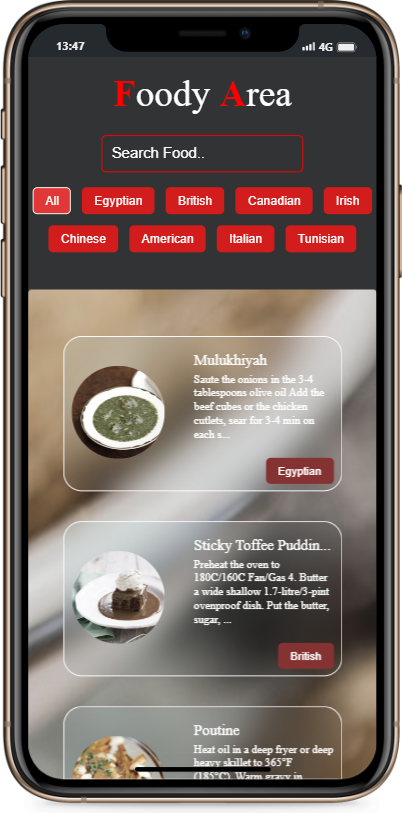
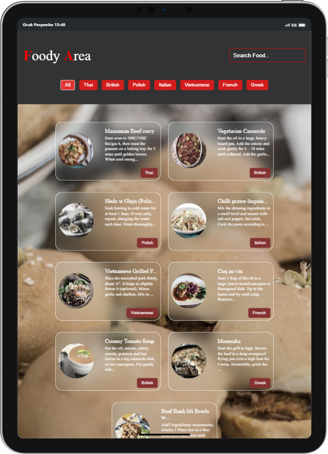
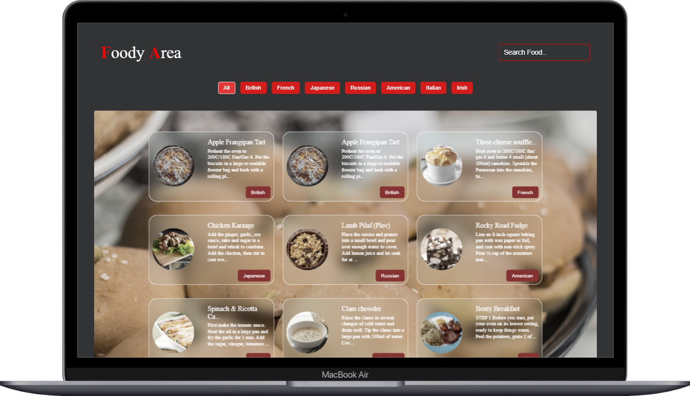

# Foody Area

It fetches and lists random foods from [The Meal DB](https://www.themealdb.com/). You can filter the incoming foods. You can find out which country the food you like is from, the name and description of the food.

## [Live Demo](https://foody-area.vercel.app/)

## Preview

<div align="center">
  
  
  
</div>

## Installation

#### Clone

```
https://github.com/gorkemuveyk/foody-area.git
```

#### Package Installation

```
npm i
```

#### Start

```
npm run dev
```
